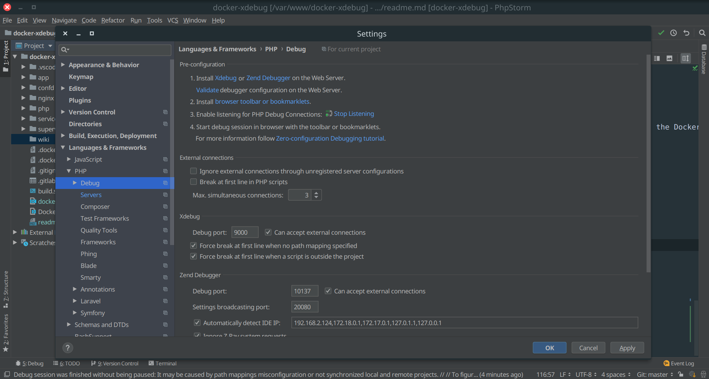
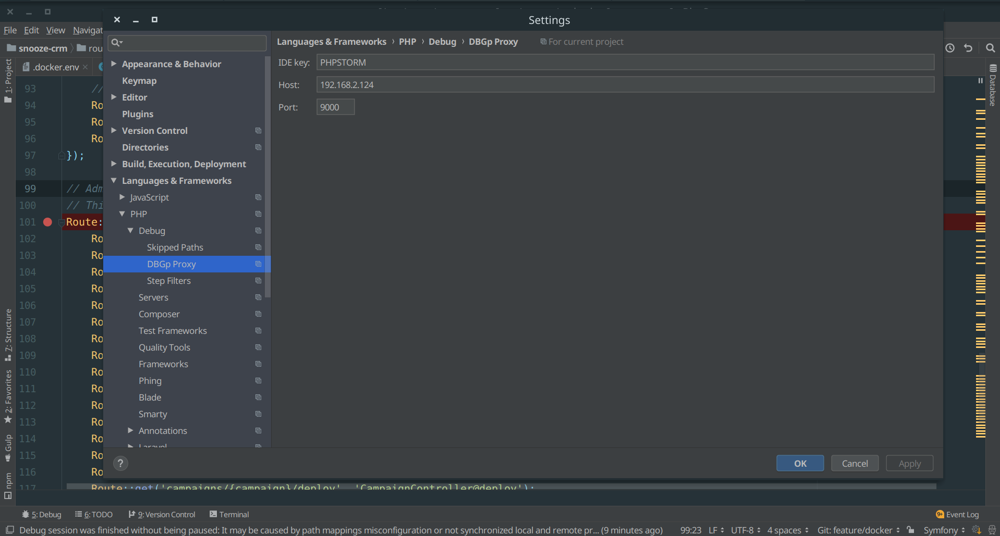
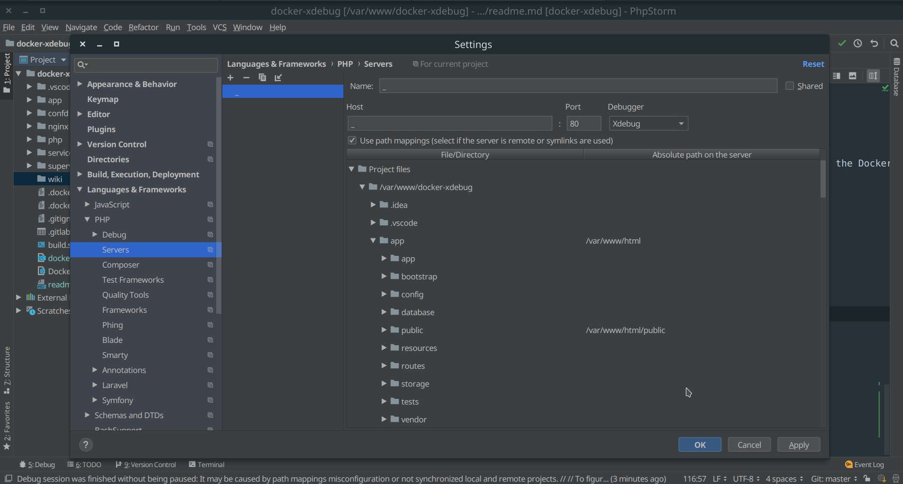
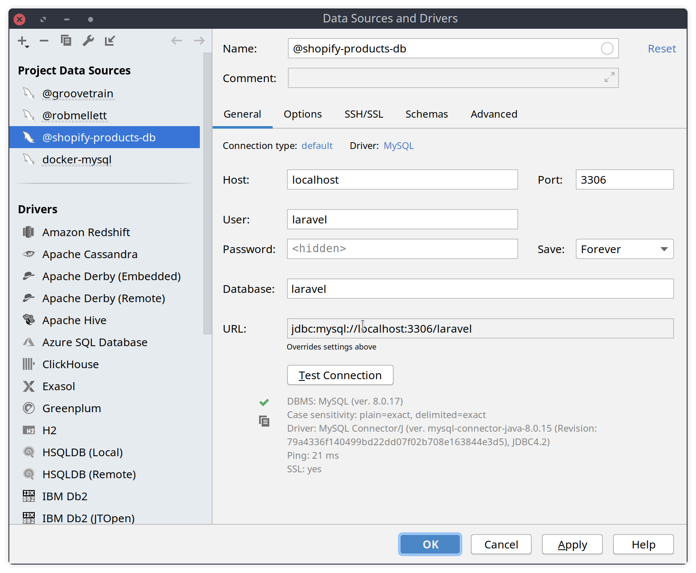

### A base Docker image with Ubuntu (18.04), Php (Xdebug), Composer, Nginx, NPM, Yarn, Prometheus Node Exporter

## Base Image 
> http://phusion.github.io/baseimage-docker/#intro

Baseimage-docker only consumes 8.3 MB RAM and is much more powerful than Busybox or Alpine. See why below.

Baseimage-docker is a special Docker image that is configured for correct use within Docker containers. It is Ubuntu, plus:

- Modifications for Docker-friendliness.
- Administration tools that are especially useful in the context of Docker.
- Mechanisms for easily running multiple processes, without violating the Docker philosophy.
- You can use it as a base for your own Docker images.

## Docker Versions
You can use the following docker images
- robmellett/lemp:7.3
- robmellett/lemp:7.2
- robmellett/lemp:7.1
- robmellett/lemp:7.0
- robmellett/lemp:5.6

## Run the application with:
```
docker-compose up --build
```

## Connect to application with:
```
docker exec -it docker-xebug_web_1 bash
```

## View site in Chrome
> http://localhost:7000

## Application has one of 3 website settings: (.docker.env)
```
app
queue
scheduler
```

## Connecting via XDebug
Make sure the website is in `/var/www/html/`, Nginx is configured to serve pages from `/var/www/html/public`.

Update values in the `.docker.env` file
- `XDEBUG_HOST` must be equal to the IP of your local host machine. Run `ip -a` to see it, not the Docker IP.

## VSCode
Create a `.vscode/launch.json` with the following.
```
{
    "version": "0.2.0",
    "configurations": [
        {
            "name": "Listen for XDebug",
            "type": "php",
            "request": "launch",
            "port": 9000,
            "log": false,
            "externalConsole": false,
            "pathMappings": {
                "/var/www/html": "${workspaceRoot}",
            },
            "ignore": ["**/vendor/**/*.php"]
        }
    ]
}
```

## Configure PHPStorm using these settings

1. Configure PHPStorm XDebug Configuration Settings


2. Configure PHPStorm DBGp Proxy Settings.  Make sure `IP Address` matches your local machine IP


3. Configure Project Path Mappings


4. Set a breakpoint in Phpstorm and you should be good to go

### Troubleshooting XDebug
`cat /etc/php/7.2/mods-available/xdebug.ini`

`cat /tmp/xdebug_remote.log`

`service php7.2-fpm reload`

### XDebug Resources
- https://serversforhackers.com/c/getting-xdebug-working
- https://www.jetbrains.com/help/phpstorm/troubleshooting-php-debugging.html
- https://www.jetbrains.com/help/phpstorm/configuring-xdebug.html
- https://www.jetbrains.com/help/phpstorm/creating-a-php-debug-server-configuration.html

## Connecting to a Docker Database Instance (Mysql/Postgres)

When connecting to the docker database you can use the settings provided in the `docker-compose.yml` file.

`localhost` and port `3306`.




## MYSQL 8 Issues
# https://github.com/laravel/framework/issues/23961

If you are given an error about laravel not being able to connect to MYSQL, or cannot find the database/host.  It's because Mysql 8 changed the way passwords are stored.

You can delete the volume name & all data with:
`docker volume rm 'dbdata'`

If you need to keep the data. Login to the MYSQL Server.

```SQL
SELECT user,host, plugin, authentication_string FROM mysql.user;
```

Run the following command
```SQL
ALTER USER 'laravel'@'localhost' IDENTIFIED WITH mysql_native_password BY 'secret';
```

## Redis
Configure redis as the default connection in `.env`.

```
QUEUE_CONNECTION=redis
```

Or for a specific job via:

```PHP
App\Jobs\ProcessJobExample::dispatch()->onConnection('redis');
```