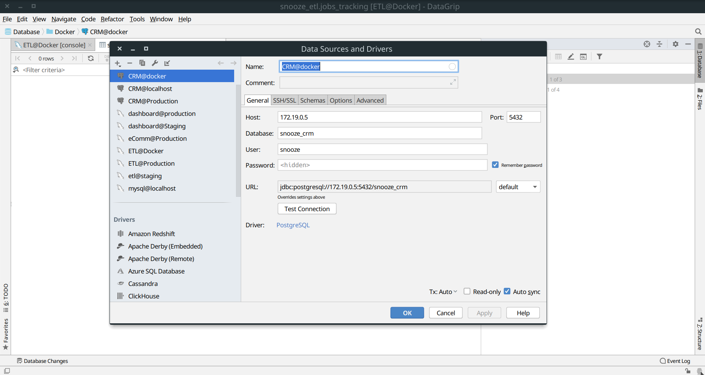

### A base Docker image with Ubuntu (16.04), Php (Xdebug), Composer, Nginx, NPM, Yarn, Prometheus Node Exporter

## Base Image 
> http://phusion.github.io/baseimage-docker/

Baseimage-docker only consumes 8.3 MB RAM and is much more powerful than Busybox or Alpine. See why below.

Baseimage-docker is a special Docker image that is configured for correct use within Docker containers. It is Ubuntu, plus:

- Modifications for Docker-friendliness.
- Administration tools that are especially useful in the context of Docker.
- Mechanisms for easily running multiple processes, without violating the Docker philosophy.
- You can use it as a base for your own Docker images.

## Run the application with:
```
docker-compose up --build
```

## Connect to application with:
```
docker exec -it docker-xebug_web_1 bash
```

## View site in Chrome
> http://localhost:7000

## Application has one of 3 website settings: (.docker.env)
```
app
queue
scheduler
```

## Connecting via XDebug
Make sure the website is in `/var/www/html/`, Nginx is configured to serve pages from `/var/www/html/public`.

Update values in the `.docker.env` file
- `XDEBUG_HOST` must be equal to the IP of your local host machine. Run `ip -a` to see it, not the Docker IP.

## Configure PHPStorm using these settings

1. Configure PHPStorm XDebug Configuration Settings


2. Configure PHPStorm XDBG Proxy Settings.  Make sure `IP Address` matches your local machine IP


3. Configure Project Path Mappings


4. Set a breakpoint in Phpstorm and you should be good to go

### Troubleshooting XDebug
`cat /etc/php/7.2/mods-available/xdebug.ini`

`cat /tmp/xdebug_remote.log`

`service php7.2-fpm reload`

### XDebug Resources
- https://serversforhackers.com/c/getting-xdebug-working
- https://www.jetbrains.com/help/phpstorm/troubleshooting-php-debugging.html
- https://www.jetbrains.com/help/phpstorm/configuring-xdebug.html
- https://www.jetbrains.com/help/phpstorm/creating-a-php-debug-server-configuration.html

## Connecting to a Docker Database Instance (Mysql/Postgres)

To get the port number on your local machine
`docker container ls`

```
CONTAINER ID        IMAGE               COMMAND                  CREATED             STATUS              PORTS                              NAMES
f44940c74964        postgres            "docker-entrypoint.s…"   12 minutes ago      Up 11 minutes       5432/tcp, 0.0.0.0:8001->3306/tcp   docker-postgres_db_1
b5d95aa50723        adminer             "entrypoint.sh docke…"   14 minutes ago      Up 11 minutes       0.0.0.0:8080->8080/tcp             docker-postgres_adminer_1

```

PORT = 5432

Run this command with the container running.

`docker inspect docker-postgres_db_1 | grep IPAddress`

```
"SecondaryIPAddresses": null,
"IPAddress": "",
    "IPAddress": "172.20.0.3",

```

Host = 172.20.0.3

Then enter this as the HOST address in Datagrip.



